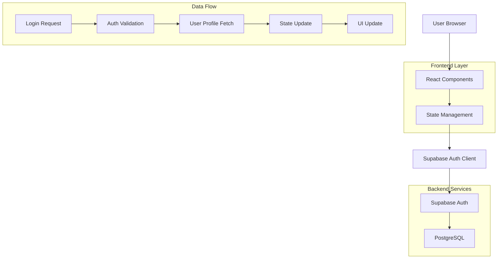
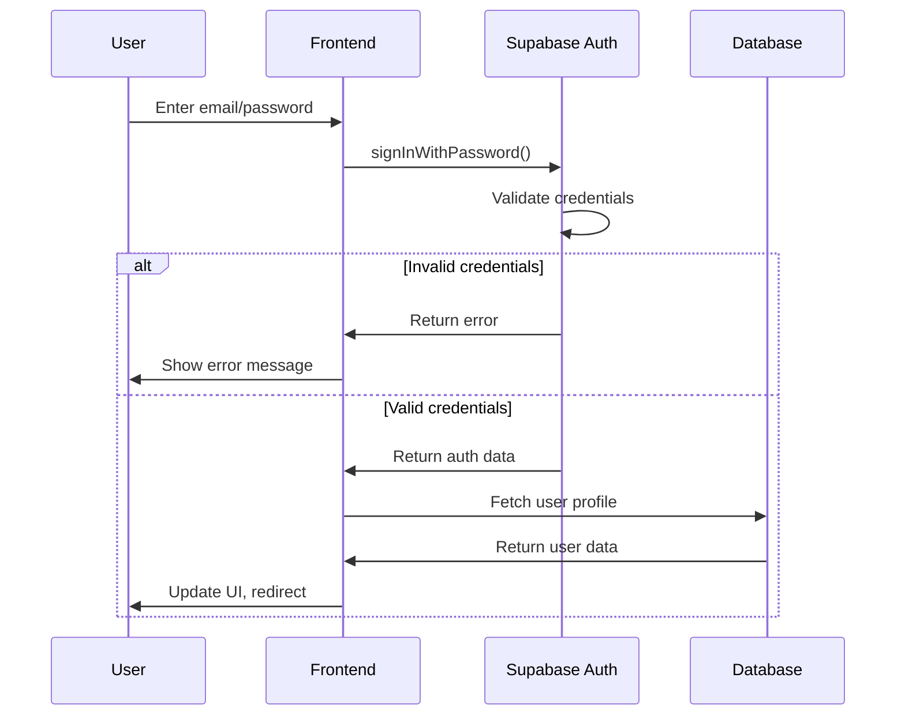
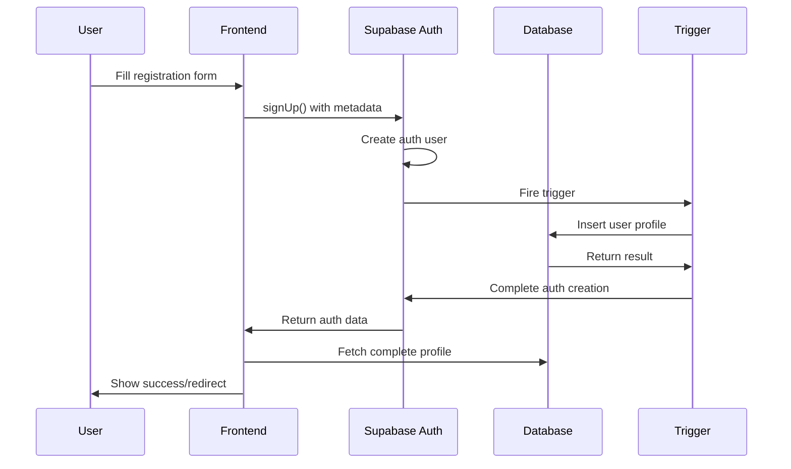
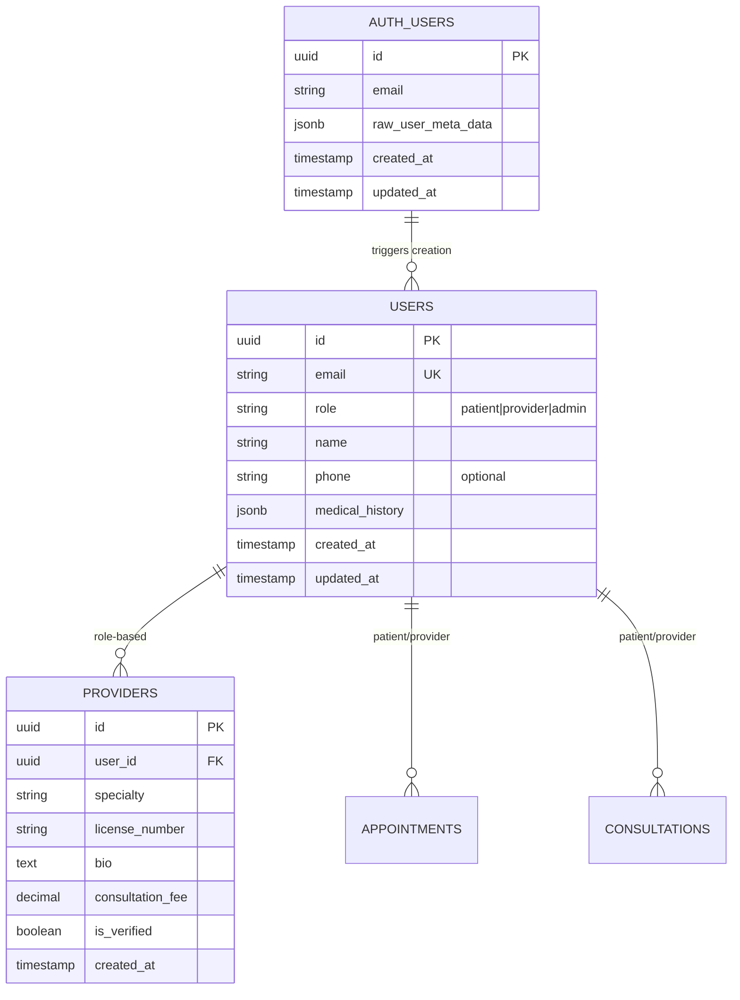

# Telio Health Authentication System - Technical Architecture

## 1. Architecture Design



## 2. Technology Description

- **Frontend**: React@18 + TypeScript + Vite
- **State Management**: Zustand for auth state
- **Authentication**: Supabase Auth (GoTrue)
- **Database**: PostgreSQL via Supabase
- **UI Framework**: TailwindCSS + Custom Components
- **Icons**: Lucide React

## 3. Route Definitions

| Route | Component | Purpose |
|-------|-----------|---------|
| `/login` | Login.tsx | Basic email/password authentication |
| `/login-enhanced` | LoginEnhanced.tsx | Advanced auth with rate limiting, magic links, social login |
| `/register` | Register.tsx | User registration with role selection |
| `/dashboard` | Dashboard.tsx | Protected route requiring authentication |
| `/connection-test` | ConnectionTest.tsx | Database connectivity diagnostics |

## 4. Authentication Flow

### 4.1 Password Authentication


### 4.2 User Registration Flow


## 5. Data Models

### 5.1 Authentication Schema


### 5.2 Database Schema (Key Tables)

```sql
-- Users table (extends Supabase auth.users)
CREATE TABLE users (
    id UUID PRIMARY KEY DEFAULT gen_random_uuid(),
    email VARCHAR(255) UNIQUE NOT NULL,
    role VARCHAR(20) NOT NULL CHECK (role IN ('patient', 'provider', 'admin')),
    name VARCHAR(100) NOT NULL,
    phone VARCHAR(20),
    medical_history JSONB DEFAULT '{}',
    created_at TIMESTAMP WITH TIME ZONE DEFAULT NOW(),
    updated_at TIMESTAMP WITH TIME ZONE DEFAULT NOW()
);

-- Providers table (extends users for provider role)
CREATE TABLE providers (
    id UUID PRIMARY KEY DEFAULT gen_random_uuid(),
    user_id UUID REFERENCES users(id) ON DELETE CASCADE,
    specialty VARCHAR(100) DEFAULT 'General Practice',
    license_number VARCHAR(50) UNIQUE,
    bio TEXT,
    consultation_fee DECIMAL(10,2) DEFAULT 0.00,
    is_verified BOOLEAN DEFAULT FALSE,
    created_at TIMESTAMP WITH TIME ZONE DEFAULT NOW()
);
```

## 6. Row Level Security (RLS) Policies

### 6.1 Users Table Policies
```sql
-- Allow users to read their own profile
CREATE POLICY "Users can view own profile" ON users
    FOR SELECT USING (auth.uid() = id);

-- Allow users to update their own profile
CREATE POLICY "Users can update own profile" ON users
    FOR UPDATE USING (auth.uid() = id);

-- Allow authenticated users to view provider profiles
CREATE POLICY "Authenticated users can view providers" ON users
    FOR SELECT USING (role = 'provider' AND auth.role() = 'authenticated');
```

### 6.2 Permission Grants
```sql
-- Grant basic permissions
GRANT SELECT ON users TO anon, authenticated;
GRANT INSERT, UPDATE, DELETE ON users TO authenticated;
```

## 7. Auth Store Implementation

### 7.1 Basic Auth Store (authStore.ts)
- Simple email/password authentication
- Basic error handling
- User profile fetching after auth

### 7.2 Enhanced Auth Store (authStoreEnhanced.ts)
- Rate limiting detection and handling
- Magic link authentication
- Social login (Google, GitHub)
- Comprehensive error states
- Retry countdown timers

## 8. Error Handling

### 8.1 Error Types
- **Invalid Credentials**: Wrong email/password combination
- **Rate Limited**: Too many login attempts
- **Database Errors**: RLS policy violations, connection issues
- **Profile Fetch Errors**: User record missing after auth

### 8.2 Error Recovery
- Automatic retry after rate limit expires
- Alternative authentication methods
- Graceful fallbacks to basic auth
- User-friendly error messages

## 9. Security Considerations

### 9.1 Authentication Security
- Password hashing handled by Supabase Auth
- JWT tokens for session management
- Automatic token refresh
- Secure cookie storage

### 9.2 Database Security
- RLS policies prevent unauthorized access
- Row-level permissions based on user ID
- Role-based access control
- Audit logging for sensitive operations

### 9.3 Rate Limiting
- Email-based rate limiting on auth endpoints
- Progressive delays for repeated failures
- Alternative auth methods bypass rate limits
- Client-side countdown display

## 10. Performance Optimization

### 10.1 Caching Strategy
- User profile cached in auth store
- Session persistence across page reloads
- Minimal database queries after initial auth

### 10.2 Lazy Loading
- Auth store initialized on demand
- User profile fetched only after successful auth
- Route-based code splitting for auth components

## 11. Testing Strategy

### 11.1 Unit Tests
- Auth store methods
- Form validation
- Error handling logic

### 11.2 Integration Tests
- Complete auth flow end-to-end
- Database connectivity
- RLS policy validation

### 11.3 Manual Testing
- Connection test page (`/connection-test`)
- User manager for creating test accounts
- Database setup validation

## 12. Deployment Considerations

### 12.1 Environment Variables
```bash
VITE_SUPABASE_URL=https://[project].supabase.co
VITE_SUPABASE_ANON_KEY=[anon-key]
```

### 12.2 Database Setup
- Run migration scripts in order
- Verify RLS policies are active
- Test trigger functions work correctly

### 12.3 Monitoring
- Supabase dashboard for auth metrics
- Database query performance
- Error rate tracking

## 13. Troubleshooting Guide

### 13.1 Common Issues
1. **"Invalid login credentials"**
   - Check environment variables
   - Verify user exists in auth.users
   - Test with connection-test page

2. **"User profile not found"**
   - Check trigger function is active
   - Verify RLS policies allow access
   - Test database connectivity

3. **Rate limiting errors**
   - Use enhanced auth store with countdown
   - Try magic link or social auth
   - Wait for retry timer to expire

### 13.2 Debug Tools
- Connection test page: `/connection-test`
- User manager: `/user-manager`
- Database setup guide: `/guide`
- Console logging in development mode