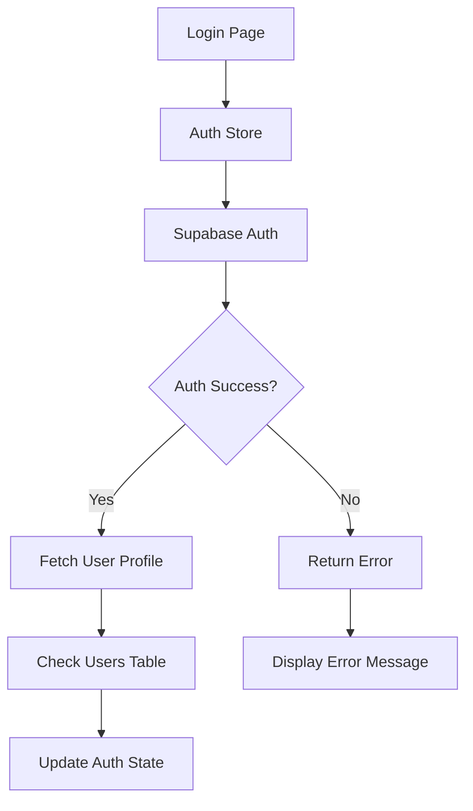

# Telio Health Login Debugging Guide

## Overview
This comprehensive guide helps debug "Invalid Login Credentials" errors in the Telio Health telehealth platform. The authentication system uses Supabase Auth with custom user profiles in a PostgreSQL database.

## Authentication Architecture



## Common Login Issues & Solutions

### 1. Environment Configuration Issues

**Problem**: Missing or incorrect Supabase credentials
**Symptoms**: "Invalid login credentials" immediately, no network requests

**Check**:
```bash
# Verify environment variables exist
echo $VITE_SUPABASE_URL
echo $VITE_SUPABASE_ANON_KEY
```

**Solution**:
1. Create `.env.local` file in project root:
```env
VITE_SUPABASE_URL=https://your-project.supabase.co
VITE_SUPABASE_ANON_KEY=your-anon-key-here
```

2. Restart development server:
```bash
npm run dev
```

### 2. Database Connection Issues

**Problem**: Users table doesn't exist or RLS policies block access
**Symptoms**: Login succeeds but user profile fetch fails

**Test Connection**:
Navigate to `/connection-test` to verify:
- ✅ Basic Supabase connection
- ✅ Auth system working
- ✅ Database connectivity
- ✅ Custom users table accessible

**Fix Database Schema**:
Run the complete schema setup in Supabase SQL editor:

```sql
-- Complete RLS Policy Fix for Telehealth Platform
-- This script drops existing policies and creates comprehensive ones

-- DROP EXISTING POLICIES (if they exist)
DROP POLICY IF EXISTS "Users can view own profile" ON public.users;
DROP POLICY IF EXISTS "Users can update own profile" ON public.users;
DROP POLICY IF EXISTS "Authenticated users can view providers" ON public.users;

-- USERS TABLE POLICIES
-- Allow users to read their own profile
CREATE POLICY "Users can view own profile" ON public.users
    FOR SELECT USING (auth.uid() = id);

-- Allow users to update their own profile
CREATE POLICY "Users can update own profile" ON public.users
    FOR UPDATE USING (auth.uid() = id);

-- Allow authenticated users to view provider profiles (for appointments)
CREATE POLICY "Authenticated users can view providers" ON public.users
    FOR SELECT USING (role = 'provider' AND auth.role() = 'authenticated');

-- GRANT BASIC PERMISSIONS
GRANT SELECT ON public.users TO anon, authenticated;
GRANT INSERT, UPDATE, DELETE ON public.users TO authenticated;

-- CREATE FUNCTION TO HANDLE USER REGISTRATION
CREATE OR REPLACE FUNCTION public.handle_new_user()
RETURNS trigger AS $$
BEGIN
    INSERT INTO public.users (id, email, name, role)
    VALUES (new.id, new.email, COALESCE(new.raw_user_meta_data->>'name', 'New User'), 'patient');
    RETURN new;
END;
$$ LANGUAGE plpgsql SECURITY DEFINER;

-- CREATE TRIGGER FOR NEW USER REGISTRATION
DROP TRIGGER IF EXISTS on_auth_user_created ON auth.users;
CREATE TRIGGER on_auth_user_created
    AFTER INSERT ON auth.users
    FOR EACH ROW EXECUTE FUNCTION public.handle_new_user();
```

### 3. Authentication Flow Issues

**Problem**: Auth succeeds but user profile creation fails
**Symptoms**: Login works but user data is null/undefined

**Debug Steps**:

1. **Check Auth Store Implementation**:
   - File: `src/stores/authStore.ts` (basic) or `src/stores/authStoreEnhanced.ts` (enhanced)
   - Look for user profile fetch after successful auth

2. **Enhanced Store Error Handling**:
```typescript
// In authStoreEnhanced.ts
signIn: async (email: string, password: string) => {
  set({ loading: true, error: null })
  
  try {
    const { data, error } = await supabase.auth.signInWithPassword({
      email,
      password,
    })

    if (error) {
      // Check for rate limit error
      if (error.message.includes('rate limit') || error.message.includes('too many requests')) {
        // Handle rate limiting
        const retryAfter = extractRetryAfter(error.message)
        set({
          rateLimitInfo: {
            isRateLimited: true,
            retryAfter,
            message: 'Email rate limit exceeded. Please try again later.'
          },
          loading: false,
          error: 'Rate limit exceeded. Please wait before trying again.'
        })
        return
      }
      
      set({ error: error.message, loading: false })
      return
    }

    if (data.user) {
      // Fetch user role from users table
      const { data: userData, error: userError } = await supabase
        .from('users')
        .select('role, full_name, created_at')
        .eq('id', data.user.id)
        .single()

      if (userError) {
        console.error('Error fetching user data:', userError)
        // This is where the issue often occurs
      }

      // Continue with user setup...
    }
  } catch (error: any) {
    set({ error: error.message, loading: false })
  }
}
```

### 4. Rate Limiting Issues

**Problem**: Too many login attempts trigger rate limiting
**Symptoms**: "Invalid login credentials" after multiple attempts

**Enhanced Store Features**:
- Automatic rate limit detection
- Countdown timer for retry
- Alternative login methods (magic link, social auth)

**Rate Limit Handling**:
```typescript
// Rate limit state tracking
rateLimitInfo: {
  isRateLimited: boolean
  retryAfter: number | null
  message: string | null
}

// Automatic retry countdown
useEffect(() => {
  if (rateLimitInfo.isRateLimited && rateLimitInfo.retryAfter) {
    setCountdown(rateLimitInfo.retryAfter)
    const timer = setInterval(() => {
      setCountdown(prev => {
        if (prev && prev > 1) {
          return prev - 1
        } else {
          resetRateLimit()
          return null
        }
      })
    }, 1000)
    return () => clearInterval(timer)
  }
}, [rateLimitInfo.isRateLimited, rateLimitInfo.retryAfter, resetRateLimit])
```

### 5. Login Page Implementation Issues

**Problem**: Form submission or navigation issues
**Symptoms**: Form doesn't submit or redirects incorrectly

**Check LoginEnhanced.tsx**:
```typescript
const handlePasswordSignIn = async (e: React.FormEvent) => {
  e.preventDefault()
  if (!email || !password) {
    alert('Please fill in all fields')
    return
  }
  
  await signIn(email, password)
  navigate('/dashboard') // This might execute before auth completes
}
```

**Fix**: Wait for auth to complete before navigation:
```typescript
const handlePasswordSignIn = async (e: React.FormEvent) => {
  e.preventDefault()
  if (!email || !password) {
    alert('Please fill in all fields')
    return
  }
  
  await signIn(email, password)
  // Navigation handled by useEffect watching user state
}

// Add useEffect for navigation
useEffect(() => {
  if (user) {
    navigate('/dashboard')
  }
}, [user, navigate])
```

## Step-by-Step Debugging Process

### Step 1: Verify Environment Setup
```bash
# Check if .env.local exists and has correct values
cat .env.local

# Expected format:
# VITE_SUPABASE_URL=https://[your-project].supabase.co
# VITE_SUPABASE_ANON_KEY=[your-anon-key]
```

### Step 2: Test Basic Connection
1. Navigate to `/connection-test`
2. Check all test results:
   - ✅ Basic Supabase connection
   - ✅ Auth system working
   - ✅ Database connectivity
   - ✅ Custom users table accessible

### Step 3: Check Browser Console
1. Open browser DevTools (F12)
2. Go to Console tab
3. Attempt login and watch for errors:
```
Error fetching user data: [error details]
Auth error: [error message]
```

### Step 4: Test Auth Directly
Create a simple test in browser console:
```javascript
// Test basic auth
const { data, error } = await supabase.auth.signInWithPassword({
  email: 'test@example.com',
  password: 'password123'
})
console.log('Auth result:', { data, error })

// Test user profile fetch
if (data.user) {
  const { data: userData, error: userError } = await supabase
    .from('users')
    .select('*')
    .eq('id', data.user.id)
    .single()
  console.log('User profile:', { userData, userError })
}
```

### Step 5: Check Supabase Dashboard
1. Go to Supabase project dashboard
2. Check Authentication > Users - verify user exists
3. Check SQL Editor > run:
```sql
-- Check if users table exists
SELECT COUNT(*) FROM information_schema.tables 
WHERE table_schema = 'public' AND table_name = 'users';

-- Check RLS policies
SELECT polname, polcmd FROM pg_policies 
WHERE schemaname = 'public' AND tablename = 'users';

-- Check permissions
SELECT grantee, privilege_type 
FROM information_schema.role_table_grants 
WHERE table_name = 'users' AND grantee IN ('anon', 'authenticated');
```

### Step 6: Test Alternative Login Methods
If password login fails, try:
1. **Magic Link**: Use "Magic Link" tab in LoginEnhanced
2. **Social Auth**: Use Google/GitHub login options
3. **Basic Store**: Try `/login` (basic version) vs `/login-enhanced`

## Quick Fixes Summary

| Issue | Quick Fix |
|-------|-----------|
| Missing env vars | Create `.env.local` with correct Supabase credentials |
| Users table missing | Run complete schema SQL in Supabase |
| RLS policy errors | Execute RLS fix script in Supabase |
| Rate limiting | Wait for countdown or use magic link/social login |
| Profile fetch fails | Check trigger function and user creation flow |
| Navigation issues | Use useEffect to watch user state changes |

## Testing Checklist

- [ ] Environment variables set correctly
- [ ] Supabase connection working (`/connection-test`)
- [ ] Users table exists with proper RLS policies
- [ ] Auth trigger function created and working
- [ ] No rate limiting active
- [ ] Browser console shows no errors
- [ ] Alternative login methods work
- [ ] User profile loads after successful auth
- [ ] Navigation redirects correctly
- [ ] User stays logged in on page refresh

## Emergency Workarounds

If login continues to fail:

1. **Use Basic Auth Store**: Switch to `/login` instead of `/login-enhanced`
2. **Manual User Creation**: Use `/user-manager` to create test users
3. **Bypass Auth**: For development, temporarily disable auth checks
4. **Reset Database**: Drop and recreate all tables with fresh schema

## Getting Help

If issues persist after following this guide:

1. **Check Supabase Status**: https://status.supabase.com/
2. **Review Logs**: Check Supabase dashboard logs for server-side errors
3. **Community Support**: Supabase Discord or GitHub discussions
4. **Provide Debug Info**: Include connection test results and console errors when asking for help