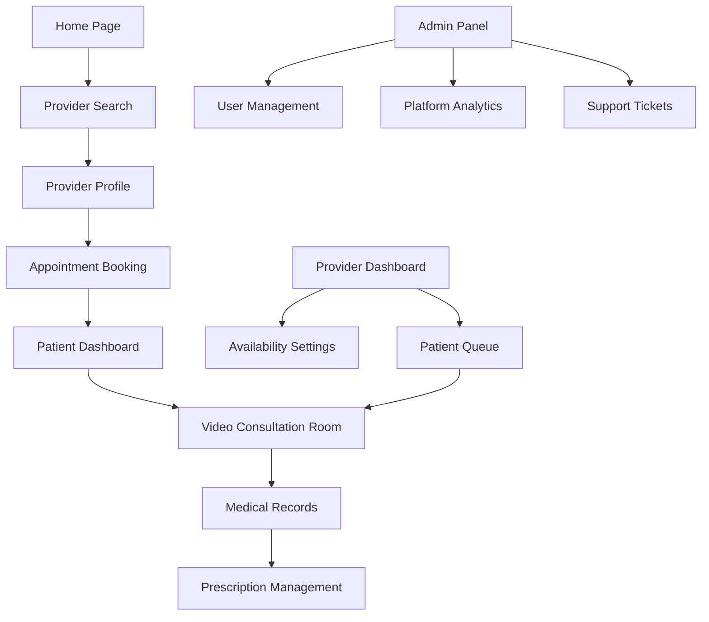

## 1. Product Overview
A comprehensive telehealth platform that connects patients with healthcare providers through secure video consultations, appointment scheduling, and medical record management. The platform solves the problem of limited healthcare access by enabling remote medical consultations, reducing wait times, and improving healthcare delivery efficiency for both patients and providers.

## 2. Core Features

### 2.1 User Roles
| Role | Registration Method | Core Permissions |
|------|---------------------|------------------|
| Patient | Email/Phone registration with medical history | Book appointments, join consultations, view medical records, manage prescriptions |
| Healthcare Provider | Medical license verification required | Set availability, conduct consultations, manage patient records, prescribe medications |
| Admin | System administrator setup | Manage users, monitor platform usage, handle support tickets |

### 2.2 Feature Module
Our telehealth platform consists of the following main pages:
1. **Home page**: Platform overview, service categories, provider search, featured doctors.
2. **Patient Dashboard**: Appointment calendar, upcoming consultations, medical history, prescription management.
3. **Provider Dashboard**: Appointment schedule, patient queue, consultation history, availability settings.
4. **Video Consultation Room**: Real-time video/audio chat, screen sharing, file sharing, chat functionality.
5. **Appointment Booking**: Provider search, calendar integration, time slot selection, payment processing.
6. **Medical Records**: Patient history, test results, prescription records, consultation notes.
7. **Profile Management**: Personal information, medical history, insurance details, notification preferences.

### 2.3 Page Details
| Page Name | Module Name | Feature description |
|-----------|-------------|---------------------|
| Home page | Provider Search | Search doctors by specialty, location, availability, ratings. |
| Home page | Service Categories | Browse healthcare services by department (cardiology, dermatology, etc.). |
| Patient Dashboard | Appointment Calendar | View upcoming appointments, reschedule/cancel options, appointment reminders. |
| Patient Dashboard | Medical History | Access consultation records, prescriptions, test results, immunization history. |
| Provider Dashboard | Patient Queue | View scheduled patients, consultation status, patient medical summary. |
| Provider Dashboard | Availability Settings | Set working hours, block time slots, set consultation duration. |
| Video Consultation Room | Video/Audio Controls | Mute/unmute, camera on/off, screen sharing, recording options. |
| Video Consultation Room | Chat Functionality | Real-time text messaging, file attachment, prescription sharing. |
| Appointment Booking | Provider Selection | Filter by specialty, availability, ratings, consultation fees. |
| Appointment Booking | Time Slot Selection | Interactive calendar with available time slots, duration options. |
| Medical Records | Document Upload | Upload test results, medical reports, insurance documents. |
| Medical Records | Prescription Management | View current medications, dosage instructions, refill requests. |
| Profile Management | Personal Information | Update contact details, emergency contacts, insurance information. |
| Profile Management | Notification Settings | Configure appointment reminders, prescription alerts, platform updates. |

## 3. Core Process
**Patient Flow**: Patient visits homepage → Searches for providers → Selects suitable doctor → Books appointment → Receives confirmation → Joins video consultation at scheduled time → Receives prescription/treatment plan → Follow-up if needed.

**Provider Flow**: Provider registers with medical credentials → Sets availability schedule → Reviews patient queue → Conducts consultation → Updates medical records → Prescribes medications if needed → Schedules follow-up if required.

**Admin Flow**: Admin monitors platform activity → Manages user accounts → Reviews consultation quality → Handles support tickets → Generates platform analytics reports.

## 4. User Interface Design

### 4.1 Design Style
- **Primary Colors**: Medical blue (#2E86AB), clean white (#FFFFFF), professional gray (#4A5568)
- **Secondary Colors**: Success green (#38A169), warning orange (#DD6B20), error red (#E53E3E)
- **Button Style**: Rounded corners (8px radius), subtle shadows, hover effects
- **Typography**: Clean sans-serif fonts (Inter/Roboto), 16px base size, clear hierarchy
- **Layout Style**: Card-based design with consistent spacing, intuitive navigation
- **Icons**: Medical-themed icons (stethoscope, calendar, video camera), consistent line weight

### 4.2 Page Design Overview
| Page Name | Module Name | UI Elements |
|-----------|-------------|-------------|
| Home page | Provider Search | Clean search bar with specialty dropdown, location input, search button with medical icon. |
| Home page | Service Categories | Grid layout of medical specialties with icons, hover effects, category descriptions. |
| Patient Dashboard | Appointment Calendar | Monthly calendar view with appointment cards, color-coded status indicators. |
| Video Consultation Room | Video Controls | Floating control bar with mute, camera, screen share buttons, recording indicator. |
| Appointment Booking | Time Slot Selection | Interactive calendar with available slots highlighted, duration selector dropdown. |

### 4.3 Responsiveness
Desktop-first design approach with mobile adaptation. Touch-optimized interface for tablets and smartphones. Responsive layouts that maintain functionality across all screen sizes.

### 4.4 3D Scene Guidance
Not applicable - this is a 2D web application focused on video consultation and medical services.