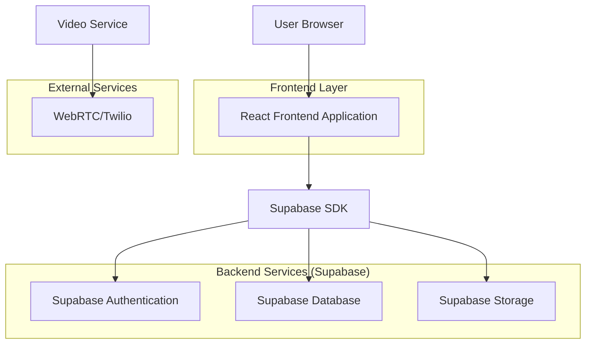
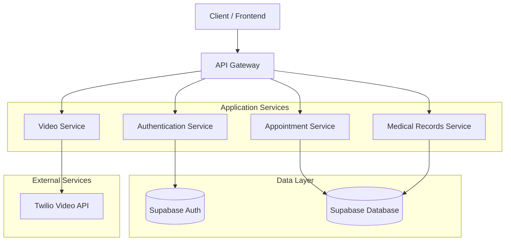
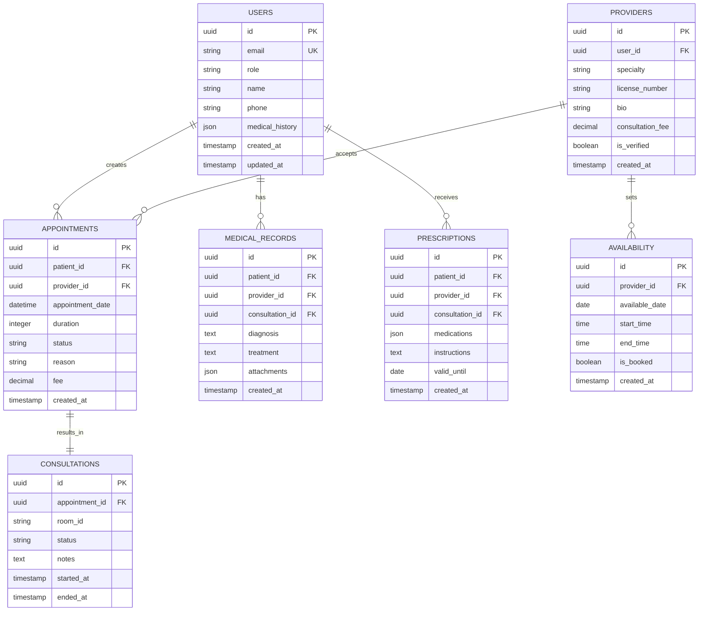

## 1. Architecture design



## 2. Technology Description

* Frontend: React\@18 + tailwindcss\@3 + vite

* Initialization Tool: vite-init

* Backend: Supabase (Authentication, Database, Storage)

* Video Service: WebRTC with Twilio Video API

* Real-time Communication: Supabase Realtime subscriptions

## 3. Route definitions

| Route                 | Purpose                                               |
| --------------------- | ----------------------------------------------------- |
| /                     | Home page with provider search and service categories |
| /login                | User authentication (patients and providers)          |
| /register             | Account registration with role selection              |
| /dashboard            | Patient or provider dashboard based on user role      |
| /appointments         | Appointment booking and management                    |
| /consultation/:id     | Video consultation room                               |
| /profile              | User profile and medical information management       |
| /medical-records      | Medical history and document management               |
| /provider-profile/:id | Healthcare provider profile page                      |

## 4. API definitions

### 4.1 Authentication APIs

User Registration

```
POST /api/auth/register
```

Request:

| Param Name | Param Type | isRequired | Description                  |
| ---------- | ---------- | ---------- | ---------------------------- |
| email      | string     | true       | User email address           |
| password   | string     | true       | User password                |
| role       | string     | true       | User role (patient/provider) |
| name       | string     | true       | Full name                    |
| phone      | string     | false      | Phone number                 |

Response:

| Param Name | Param Type | Description            |
| ---------- | ---------- | ---------------------- |
| user\_id   | string     | Unique user identifier |
| role       | string     | Assigned user role     |
| token      | string     | Authentication token   |

### 4.2 Appointment APIs

Create Appointment

```
POST /api/appointments
```

Request:

| Param Name        | Param Type | isRequired | Description                      |
| ----------------- | ---------- | ---------- | -------------------------------- |
| provider\_id      | string     | true       | Healthcare provider ID           |
| patient\_id       | string     | true       | Patient ID                       |
| appointment\_date | datetime   | true       | Scheduled date and time          |
| duration          | integer    | true       | Consultation duration in minutes |
| reason            | string     | true       | Reason for appointment           |

Response:

| Param Name        | Param Type | Description                              |
| ----------------- | ---------- | ---------------------------------------- |
| appointment\_id   | string     | Unique appointment identifier            |
| status            | string     | Appointment status (scheduled/confirmed) |
| consultation\_url | string     | Video consultation room URL              |

### 4.3 Video Consultation APIs

Start Consultation

```
POST /api/consultations/start
```

Request:

| Param Name      | Param Type | isRequired | Description                        |
| --------------- | ---------- | ---------- | ---------------------------------- |
| appointment\_id | string     | true       | Appointment identifier             |
| participant\_id | string     | true       | User participating in consultation |

Response:

| Param Name     | Param Type | Description                    |
| -------------- | ---------- | ------------------------------ |
| room\_id       | string     | Video room identifier          |
| access\_token  | string     | Token for video service access |
| webrtc\_config | object     | WebRTC configuration settings  |

## 5. Server architecture diagram



## 6. Data model

### 6.1 Data model definition



### 6.2 Data Definition Language

Users Table

```sql
-- create table
CREATE TABLE users (
    id UUID PRIMARY KEY DEFAULT gen_random_uuid(),
    email VARCHAR(255) UNIQUE NOT NULL,
    password_hash VARCHAR(255) NOT NULL,
    role VARCHAR(20) NOT NULL CHECK (role IN ('patient', 'provider', 'admin')),
    name VARCHAR(100) NOT NULL,
    phone VARCHAR(20),
    medical_history JSONB DEFAULT '{}',
    created_at TIMESTAMP WITH TIME ZONE DEFAULT NOW(),
    updated_at TIMESTAMP WITH TIME ZONE DEFAULT NOW()
);

-- create indexes
CREATE INDEX idx_users_email ON users(email);
CREATE INDEX idx_users_role ON users(role);

-- grant permissions
GRANT SELECT ON users TO anon;
GRANT ALL PRIVILEGES ON users TO authenticated;
```

Providers Table

```sql
-- create table
CREATE TABLE providers (
    id UUID PRIMARY KEY DEFAULT gen_random_uuid(),
    user_id UUID REFERENCES users(id) ON DELETE CASCADE,
    specialty VARCHAR(100) NOT NULL,
    license_number VARCHAR(50) UNIQUE NOT NULL,
    bio TEXT,
    consultation_fee DECIMAL(10,2) DEFAULT 0.00,
    is_verified BOOLEAN DEFAULT FALSE,
    created_at TIMESTAMP WITH TIME ZONE DEFAULT NOW()
);

-- create indexes
CREATE INDEX idx_providers_user_id ON providers(user_id);
CREATE INDEX idx_providers_specialty ON providers(specialty);
CREATE INDEX idx_providers_verified ON providers(is_verified);

-- grant permissions
GRANT SELECT ON providers TO anon;
GRANT ALL PRIVILEGES ON providers TO authenticated;
```

Appointments Table

```sql
-- create table
CREATE TABLE appointments (
    id UUID PRIMARY KEY DEFAULT gen_random_uuid(),
    patient_id UUID REFERENCES users(id) ON DELETE CASCADE,
    provider_id UUID REFERENCES providers(id) ON DELETE CASCADE,
    appointment_date TIMESTAMP WITH TIME ZONE NOT NULL,
    duration INTEGER NOT NULL DEFAULT 30,
    status VARCHAR(20) DEFAULT 'scheduled' CHECK (status IN ('scheduled', 'confirmed', 'completed', 'cancelled')),
    reason TEXT,
    fee DECIMAL(10,2) DEFAULT 0.00,
    created_at TIMESTAMP WITH TIME ZONE DEFAULT NOW()
);

-- create indexes
CREATE INDEX idx_appointments_patient_id ON appointments(patient_id);
CREATE INDEX idx_appointments_provider_id ON appointments(provider_id);
CREATE INDEX idx_appointments_date ON appointments(appointment_date);
CREATE INDEX idx_appointments_status ON appointments(status);

-- grant permissions
GRANT SELECT ON appointments TO anon;
GRANT ALL PRIVILEGES ON appointments TO authenticated;
```

Consultations Table

```sql
-- create table
CREATE TABLE consultations (
    id UUID PRIMARY KEY DEFAULT gen_random_uuid(),
    appointment_id UUID REFERENCES appointments(id) ON DELETE CASCADE,
    room_id VARCHAR(100) UNIQUE NOT NULL,
    status VARCHAR(20) DEFAULT 'waiting' CHECK (status IN ('waiting', 'active', 'completed')),
    notes TEXT,
    started_at TIMESTAMP WITH TIME ZONE,
    ended_at TIMESTAMP WITH TIME ZONE,
    created_at TIMESTAMP WITH TIME ZONE DEFAULT NOW()
);

-- create indexes
CREATE INDEX idx_consultations_appointment_id ON consultations(appointment_id);
CREATE INDEX idx_consultations_room_id ON consultations(room_id);
CREATE INDEX idx_consultations_status ON consultations(status);

-- grant permissions
GRANT SELECT ON consultations TO anon;
GRANT ALL PRIVILEGES ON consultations TO authenticated;
```

